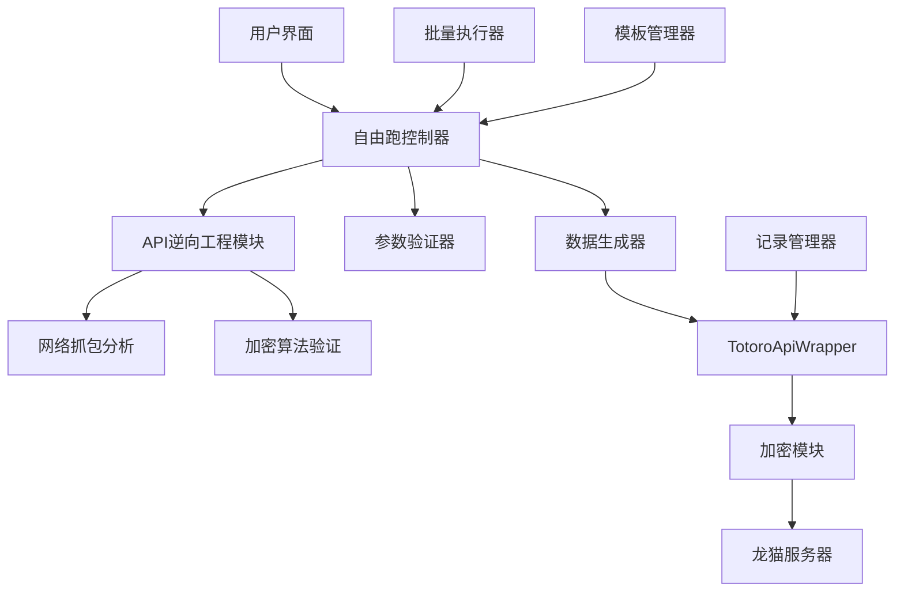

# 自由跑功能设计文档

## 概述

本设计文档描述了在现有Totoro Paradise项目基础上，新增"自由跑"功能的技术实现方案。自由跑功能允许用户模拟提交自定义距离和时间的跑步记录，不受固定路线限制。

**关键挑战**: 现有项目中没有真实的自由跑API实现，需要通过逆向工程发现龙猫校园自由跑功能的真实API端点和数据格式。

## 架构

### 整体架构图



### 分层架构

1. **表现层 (Presentation Layer)**
   - 自由跑设置页面
   - 跑步执行页面
   - 记录查看页面
   - 批量执行界面

2. **业务逻辑层 (Business Logic Layer)**
   - 参数验证和计算
   - 数据生成和伪造
   - 批量执行控制
   - 模板管理

3. **API逆向工程层 (Reverse Engineering Layer)**
   - 网络流量分析
   - API端点发现
   - 数据格式解析
   - 加密算法验证

4. **数据访问层 (Data Access Layer)**
   - 龙猫API通信
   - 本地记录存储
   - 加密/解密处理

## 组件和接口

### 核心组件

#### 1. API逆向工程模块 (ReverseEngineeringModule)

```typescript
interface ReverseEngineeringModule {
  // 网络流量分析
  analyzeNetworkTraffic(pcapFile: string): Promise<ApiEndpoint[]>;
  
  // API端点发现
  discoverFreeRunEndpoints(): Promise<FreeRunApiSpec>;
  
  // 数据格式分析
  analyzeRequestFormat(requests: NetworkRequest[]): RequestSchema;
  analyzeResponseFormat(responses: NetworkResponse[]): ResponseSchema;
  
  // 加密验证
  verifyEncryption(sampleData: string): EncryptionInfo;
}

interface FreeRunApiSpec {
  endpoints: {
    submit: string;
    query: string;
    detail: string;
  };
  requestFormat: RequestSchema;
  responseFormat: ResponseSchema;
  encryption: EncryptionInfo;
}
```

#### 2. 自由跑数据生成器 (FreeRunDataGenerator)

```typescript
interface FreeRunDataGenerator {
  generateRunData(params: FreeRunParams): Promise<FreeRunData>;
  generateBatchData(batchParams: BatchRunParams): Promise<FreeRunData[]>;
  validateParameters(params: FreeRunParams): ValidationResult;
}

interface FreeRunParams {
  distance: number;        // 距离（公里）
  targetTime?: number;     // 目标时间（秒）
  avgSpeed?: number;       // 平均速度（km/h）
  template?: RunTemplate;  // 预设模板
}

interface FreeRunData {
  distance: string;
  duration: string;
  avgSpeed: string;
  avgPace: string;
  calorie: string;
  steps: string;
  startTime: string;
  endTime: string;
  mac: string;
  deviceInfo: string;
}
```

#### 3. 自由跑API包装器 (FreeRunApiWrapper)

```typescript
interface FreeRunApiWrapper {
  // 提交自由跑数据
  submitFreeRun(data: FreeRunData, session: UserSession): Promise<FreeRunResponse>;
  
  // 查询自由跑记录
  getFreeRunRecords(session: UserSession, filters?: RecordFilters): Promise<FreeRunRecord[]>;
  
  // 获取记录详情
  getFreeRunDetail(recordId: string, session: UserSession): Promise<FreeRunDetail>;
  
  // 批量提交
  submitBatchRuns(dataList: FreeRunData[], session: UserSession): Promise<BatchResponse>;
}
```

#### 4. 参数验证器 (ParameterValidator)

```typescript
interface ParameterValidator {
  validateDistance(distance: number): ValidationResult;
  validateSpeed(speed: number): ValidationResult;
  validateTime(time: number): ValidationResult;
  validateBatchParams(params: BatchRunParams): ValidationResult;
  calculateDerivedValues(params: FreeRunParams): DerivedValues;
}

interface ValidationResult {
  isValid: boolean;
  errors: string[];
  warnings: string[];
}
```

#### 5. 模板管理器 (TemplateManager)

```typescript
interface TemplateManager {
  getAvailableTemplates(): RunTemplate[];
  applyTemplate(templateId: string): FreeRunParams;
  createCustomTemplate(name: string, params: FreeRunParams): RunTemplate;
}

interface RunTemplate {
  id: string;
  name: string;
  description: string;
  defaultParams: FreeRunParams;
  speedRange: [number, number];
  distanceRange: [number, number];
}
```

### 接口定义

#### 网络请求接口

```typescript
interface NetworkRequest {
  url: string;
  method: string;
  headers: Record<string, string>;
  body: string;
  timestamp: number;
}

interface NetworkResponse {
  status: number;
  headers: Record<string, string>;
  body: string;
  timestamp: number;
}
```

#### 批量执行接口

```typescript
interface BatchRunParams {
  count: number;           // 执行次数 (1-10)
  interval: number;        // 间隔时间（分钟，1-60）
  baseParams: FreeRunParams;
  randomization: {
    distanceVariation: number;  // 距离变化范围（±公里）
    speedVariation: number;     // 速度变化范围（±km/h）
    timeVariation: number;      // 时间变化范围（±分钟）
  };
}

interface BatchResponse {
  totalSubmitted: number;
  successCount: number;
  failureCount: number;
  results: Array<{
    index: number;
    success: boolean;
    recordId?: string;
    error?: string;
  }>;
}
```

## 数据模型

### 自由跑记录模型

```typescript
interface FreeRunRecord {
  recordId: string;
  stuNumber: string;
  schoolId: string;
  distance: string;
  duration: string;
  avgSpeed: string;
  avgPace: string;
  calorie: string;
  steps: string;
  startTime: string;
  endTime: string;
  submitTime: string;
  status: 'completed' | 'failed' | 'pending';
  runType: '1';  // 自由跑标识
}
```

### API规格模型

```typescript
interface ApiEndpoint {
  path: string;
  method: 'GET' | 'POST' | 'PUT' | 'DELETE';
  description: string;
  sampleRequest?: any;
  sampleResponse?: any;
}

interface RequestSchema {
  requiredFields: string[];
  optionalFields: string[];
  fieldTypes: Record<string, string>;
  validation: Record<string, ValidationRule>;
}

interface EncryptionInfo {
  algorithm: string;
  keySize: number;
  padding: string;
  publicKey?: string;
  privateKey?: string;
}
```

## 正确性属性

*属性是一个特征或行为，应该在系统的所有有效执行中保持为真——本质上，是关于系统应该做什么的正式声明。属性作为人类可读规范和机器可验证正确性保证之间的桥梁。*

### 数据生成属性

**属性 1: 距离验证范围**
*对于任何*距离输入，验证函数应该只接受0.5到20公里范围内的值
**验证: 需求 1.3**

**属性 2: 速度计算一致性**
*对于任何*有效的距离和时间组合，计算出的平均速度应该在3-25公里/小时范围内
**验证: 需求 1.4**

**属性 3: 时间计算准确性**
*对于任何*距离和速度输入，计算的用时应该等于距离除以速度乘以3600秒
**验证: 需求 2.1**

**属性 4: 配速格式一致性**
*对于任何*有效速度，配速应该以"分钟:秒"格式显示，且计算正确
**验证: 需求 2.2**

**属性 5: 卡路里计算合理性**
*对于任何*距离和速度组合，计算的卡路里应该在合理范围内（基于标准公式）
**验证: 需求 2.3**

**属性 6: 步数生成范围**
*对于任何*距离，生成的步数应该在每公里1150-1250步的范围内
**验证: 需求 2.4**

**属性 7: MAC地址唯一性**
*对于任何*不同的学号，生成的MAC地址应该是唯一的且格式正确
**验证: 需求 2.5**

### 参数验证属性

**属性 8: 参数验证一致性**
*对于任何*参数组合，当所有参数都有效时，"开始跑步"按钮应该被启用
**验证: 需求 1.5**

**属性 9: 批量参数验证**
*对于任何*批量参数，次数应该在1-10范围内，间隔应该在1-60分钟范围内
**验证: 需求 7.2, 7.3**

### 数据处理属性

**属性 10: 记录过滤正确性**
*对于任何*记录集合，按自由跑类型过滤应该只返回runType='1'的记录
**验证: 需求 4.2**

**属性 11: 记录显示完整性**
*对于任何*自由跑记录，显示应该包含日期、距离、用时、平均速度和卡路里信息
**验证: 需求 4.3**

**属性 12: 记录详情导航**
*对于任何*有效记录ID，点击记录应该能够导航到对应的详情页面
**验证: 需求 4.4**

### 加密和通信属性

**属性 13: 加密往返一致性**
*对于任何*有效的请求数据，加密后再解密应该得到原始数据
**验证: 需求 5.2**

**属性 14: 请求格式合规性**
*对于任何*自由跑数据，生成的请求应该严格符合发现的API格式要求
**验证: 需求 5.3**

**属性 15: 错误响应解析**
*对于任何*服务器错误响应，系统应该能够正确解析并提取错误信息
**验证: 需求 5.5**

### 批量执行属性

**属性 16: 批量参数随机化**
*对于任何*批量执行，每次跑步的参数应该在指定范围内有所不同
**验证: 需求 7.4**

**属性 17: 错误处理完整性**
*对于任何*错误情况，系统应该提供详细的错误信息和恢复建议
**验证: 需求 6.5**

## 错误处理

### 错误分类

1. **网络错误**
   - 连接超时
   - 服务器不可达
   - DNS解析失败

2. **API错误**
   - 认证失败
   - 参数验证失败
   - 服务器内部错误

3. **数据错误**
   - 加密/解密失败
   - 数据格式错误
   - 参数超出范围

4. **逆向工程错误**
   - 无法发现API端点
   - 加密算法不匹配
   - 数据格式解析失败

### 错误处理策略

```typescript
interface ErrorHandler {
  handleNetworkError(error: NetworkError): ErrorResponse;
  handleApiError(error: ApiError): ErrorResponse;
  handleDataError(error: DataError): ErrorResponse;
  handleReverseEngineeringError(error: ReverseEngineeringError): ErrorResponse;
}

interface ErrorResponse {
  message: string;
  code: string;
  recoverable: boolean;
  retryable: boolean;
  suggestions: string[];
}
```

### 重试机制

```typescript
interface RetryConfig {
  maxAttempts: number;
  backoffStrategy: 'linear' | 'exponential';
  baseDelay: number;
  maxDelay: number;
  retryableErrors: string[];
}
```

## 测试策略

### 双重测试方法

本设计采用单元测试和基于属性的测试相结合的方法：

- **单元测试**验证具体示例、边缘情况和错误条件
- **属性测试**验证应该在所有输入中保持的通用属性
- 两者结合提供全面覆盖：单元测试捕获具体错误，属性测试验证通用正确性

### 单元测试要求

单元测试通常涵盖：
- 演示正确行为的具体示例
- 组件之间的集成点
- 单元测试很有用，但避免写太多。属性测试的工作是处理大量输入的覆盖。

### 基于属性的测试要求

- 使用**fast-check**作为JavaScript/TypeScript的属性测试库
- 每个属性测试配置为运行最少100次迭代
- 每个属性测试必须用注释明确引用设计文档中的正确性属性
- 使用此确切格式标记每个属性测试：'**Feature: free-run-feature, Property {number}: {property_text}**'
- 每个正确性属性必须由单个属性测试实现

### 测试覆盖范围

1. **API逆向工程测试**
   - 网络流量解析准确性
   - API端点发现完整性
   - 加密算法验证正确性

2. **数据生成测试**
   - 参数验证边界条件
   - 计算公式准确性
   - 随机数生成分布

3. **网络通信测试**
   - 请求格式合规性
   - 响应解析正确性
   - 错误处理完整性

4. **用户界面测试**
   - 参数输入验证
   - 状态管理正确性
   - 错误信息显示

## 实施计划

### 阶段1: API逆向工程 (2-3周)

1. **环境准备**
   - 安装网络抓包工具
   - 配置测试设备和账号
   - 准备分析工具

2. **流量分析**
   - 监控龙猫校园自由跑功能
   - 记录所有网络请求和响应
   - 分析数据格式和加密方式

3. **API规格文档化**
   - 整理发现的API端点
   - 定义请求和响应格式
   - 验证加密算法兼容性

### 阶段2: 核心功能开发 (3-4周)

1. **数据模型和类型定义**
   - 定义自由跑相关的TypeScript接口
   - 创建API请求和响应类型
   - 实现数据验证逻辑

2. **数据生成器实现**
   - 实现参数验证和计算
   - 开发数据伪造算法
   - 集成加密和MAC生成

3. **API包装器扩展**
   - 扩展TotoroApiWrapper支持自由跑
   - 实现请求构造和响应解析
   - 添加错误处理和重试机制

### 阶段3: 用户界面开发 (2-3周)

1. **页面组件开发**
   - 自由跑设置页面
   - 跑步执行页面
   - 记录查看页面

2. **状态管理**
   - 扩展现有的composables
   - 实现自由跑状态管理
   - 集成表单验证

3. **用户体验优化**
   - 添加进度指示器
   - 实现错误提示
   - 优化响应式设计

### 阶段4: 高级功能开发 (2-3周)

1. **批量执行功能**
   - 实现批量参数设置
   - 开发批量执行控制器
   - 添加进度监控

2. **模板管理**
   - 实现预设模板
   - 支持自定义模板
   - 模板导入导出

3. **记录管理**
   - 实现记录查询和过滤
   - 添加记录详情页面
   - 支持记录导出

### 阶段5: 测试和优化 (1-2周)

1. **测试实现**
   - 编写单元测试
   - 实现属性测试
   - 集成测试覆盖

2. **性能优化**
   - 优化网络请求
   - 改进用户界面响应
   - 减少内存使用

3. **文档和部署**
   - 更新用户文档
   - 准备部署配置
   - 进行最终测试

## 风险缓解

### 技术风险

1. **API逆向工程失败**
   - 缓解：准备多种分析工具和方法
   - 备选：寻找其他可能的API端点

2. **加密算法不兼容**
   - 缓解：深入分析加密实现
   - 备选：开发新的加密模块

3. **数据格式差异过大**
   - 缓解：灵活的数据适配器设计
   - 备选：重新设计数据结构

### 业务风险

1. **账号被封禁**
   - 缓解：使用测试账号进行开发
   - 备选：实现更智能的行为模拟

2. **API端点变更**
   - 缓解：设计灵活的配置系统
   - 备选：快速适配新的API版本

3. **检测机制升级**
   - 缓解：持续监控和改进伪造算法
   - 备选：开发更高级的反检测技术

## 部署考虑

### 环境要求

- Node.js 18+
- TypeScript 5.3+
- 现有的Nuxt 3项目依赖
- 网络抓包工具（开发阶段）

### 配置管理

```typescript
interface FreeRunConfig {
  api: {
    endpoints: Record<string, string>;
    encryption: EncryptionConfig;
    timeout: number;
    retryConfig: RetryConfig;
  };
  dataGeneration: {
    defaultTemplates: RunTemplate[];
    validationRules: ValidationRules;
    randomizationConfig: RandomizationConfig;
  };
  ui: {
    defaultParams: FreeRunParams;
    validationMessages: Record<string, string>;
  };
}
```

### 监控和日志

```typescript
interface Logger {
  logApiCall(endpoint: string, request: any, response: any): void;
  logError(error: Error, context: any): void;
  logPerformance(operation: string, duration: number): void;
  logUserAction(action: string, params: any): void;
}
```

这个设计文档为自由跑功能的实现提供了全面的技术指导，重点强调了API逆向工程的重要性和挑战性，同时保持了与现有项目架构的兼容性。